## Use Case

ABC Technologies is a prominent e-commerce platform that has recently obtained a sizable brick-and-mortar retail establishment. This retail entity boasts numerous physical stores worldwide but has adhered to traditional methods of growth and expansion. Consequently, it has incurred significant losses and is grappling with the subsequent hurdles.

- Low available.
- Low scalable.
- Low performance.
- Hard to build maintain.

Developing and deploying consume significant time and resources. ABC Technologies aims to leverage data from various storage systems to drive analytics and predict the company's growth and sales trajectory. Initially, ABC will focus on creating servlets for product addition and displaying product details. It's essential to include servlet dependencies necessary for compiling the servlets. Additionally, an HTML page will be developed for adding products.

The team employs Git for source code management. ABC has opted to adopt the DevOps model. Once the source code is hosted on GitHub, integration with Jenkins will enable continuous build generation for seamless continuous delivery. Furthermore, integration with Ansible and Kubernetes is vital for efficient deployment. Docker Hub will facilitate the transfer of images between Ansible and Kubernetes, ensuring smooth operations.

## Goal of the Project

To implement CI/CD such that ABC Company is able to be —

- high available
- high scalable
- high performant
- easily built and maintained
- developed and deployed quickly

## Problem Statements / Tasks

We need to develop a CI/CD pipeline to automate the software development, testing, packaging, and deployment, reducing the time to market the app and ensuring good quality service is experienced by end users. In this project, we need to —

- Push the code to our GitHub repository
- Create a continuous integration pipeline using Jenkins to compile, test, and package the code present in GitHub.
- Write Dockerfile to push the war file to the Tomcat server
- Integrate Docker with Ansible and write the playbook
- Deploy artifacts to the Kubernetes cluster
- Monitor resources using Grafana.

## Task 1: Clone the project from the GitHub link shared in resources to your local machine. Build the code using Maven commands.

### Setup Project

> **Important Note:** All commands below should be run from the root directory.

- To achieve this task first of all, download the provided Java Source Code into on my Local PC and then created a GitHub Repository and uploaded all the project files to the repo.
  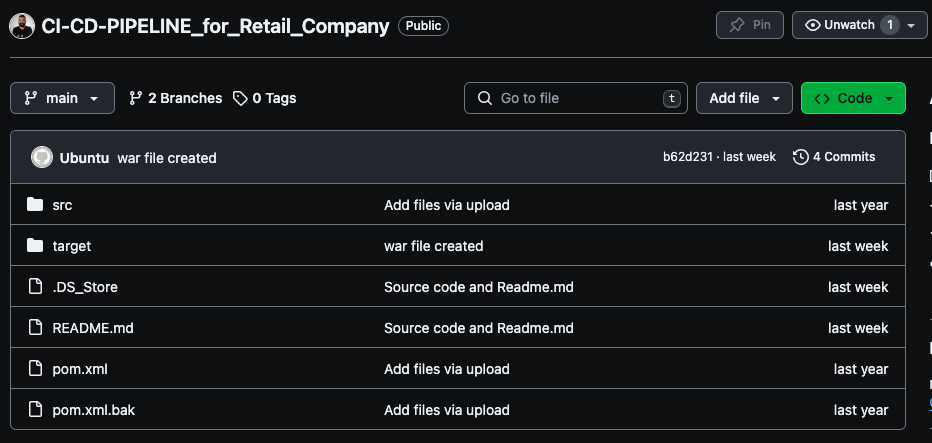

- Launch an EC2 Linux instance (type: t2.micro) named retail-app-master. set the security group rule to allow all traffic from anywhere and create the instance.
  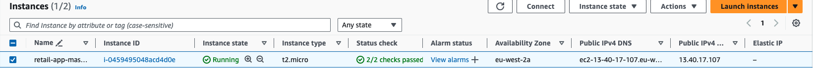

- Connect to retail-app-pro server using local terminal and installed git to retail-app-master instance.

  `sudo apt-get install git`

- Clone the repository using git clone command as shown below to clone the repo from my Github to my Amazon EC2 Linux machine.

  `git clone https://github.com/robinucar/CI-CD-PIPELINE_for_Retail_Company.git`

- Install java to my EC2 retail-app-master instance.

  ```
   #To update the machine
      sudo apt update
    #To install java
      sudo apt install openjdk-11-jdk -y
  ```

- Install Jenkins

  - To install jenkins go to the website [Jenkins](https://pkg.jenkins.io/debian-stable/) and then select “debian-stable/”for a stable version of jenkins. Follow the procedure to install jenkins.

    ```sudo wget -O /usr/share/keyrings/jenkins-keyring.asc \
      https://pkg.jenkins.io/debian-stable/jenkins.io-2023.key

      # Then add a Jenkins apt repository entry:

      echo deb [signed-by=/usr/share/keyrings/jenkins-keyring.asc] \
      https://pkg.jenkins.io/debian-stable binary/ | sudo tee \
      /etc/apt/sources.list.d/jenkins.list > /dev/null

      # Update your local package index, then finally install Jenkins:

        sudo apt-get update
        sudo apt-get install fontconfig openjdk-11-jre
        sudo apt-get install jenkins
    ```

  - Start jenkins using the command:

    ```
    sudo systemctl start jenkins
    sudo systemctl enable jenkins
    sudo systemctl status jenkins
    ```

- Install Maven which will be used to Compile, Test and Package the Code. Run the following commands to install maven

  ```
    sudo apt update
    sudo apt install maven
    mvn -version
  ```

  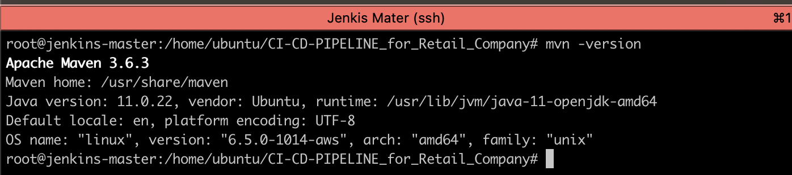

**Now all the setup required is done. We need to start to building.**

### Building process

1. Navigate to the directory in which the source code and files are and then run the command below:

```
  cd CI-CD-PIPELINE_for_Retail_Company/
  mvn compile
```

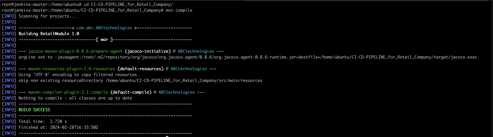

2. Testing the code: To test the code go to directory which the source code and files are and then run the command below:

`mvn test`

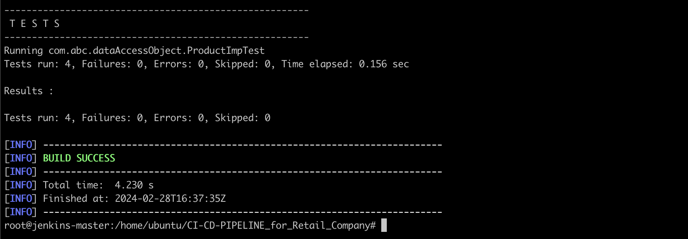

3. Packaging the code: To package the code go to directory which the source code and files are and then run the command below:

`mvn package`

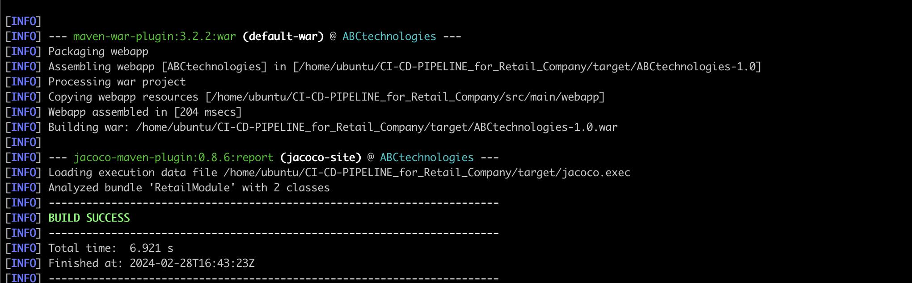

**_War File Created_**

The result output, the war file file created in the target folder is as shown below image.
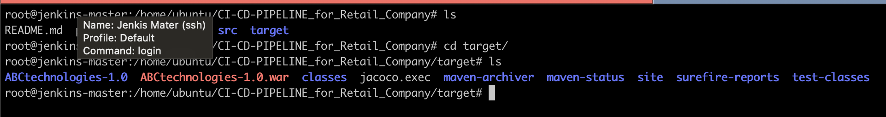

**_ END OF TASK 1 _**

## Task 2: Login to Jenkins and start to create build pipeline containing the jobs.

1.  Log in to Jenkins

- Jenkins can be accessed over the browsers through the port number 8080. Take the public ip address from the EC2 Instance and paste the code below on the browser.

```
  public IP address:8080
  # in my case
    13.40.17.107:8080
```

**\_To resolve any connection issues, ensure that you add custom TCP port 8080 to the inbound rules of the security group.**
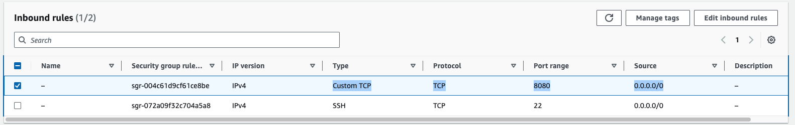

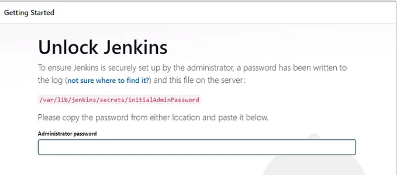

**Get the password, run the code below on your terminal.**

`cat /var/lib/jenkins/secrets/initialAdminPassword`

Then copy the password and paste to administrator password of Jenkins login page. Follow the promts until the dashboard access is fully set.

2. The next step is to set up the necessary tools with Jenkins: Maven, Java, and Git.
   To do this, go to the Jenkins dashboard > Manage Jenkins > Tools.

- Use the command below to find the JAVA_HOME.

```
  update-alternatives --config java
```

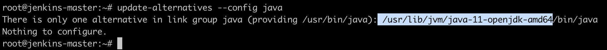

**The selected part of output is JAVA_HOME**

- Copy the JAVA_HOME address as shown in the image above, then paste it into the Jenkins JDK installations tool..
  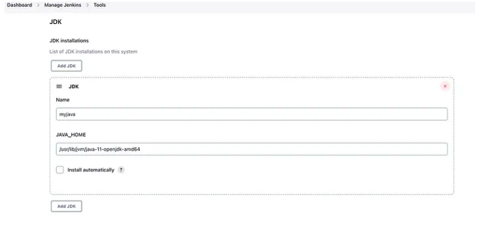

- For Git Integration we do need to make any changes, we work with the default settings.

- Maven has already been installed through the CLI. The MAVEN_HOME from the selected part of the output below should be copied, and then pasted into the 'MAVEN_HOME' input field in the Jenkins Maven tool. Then click 'Save'.
  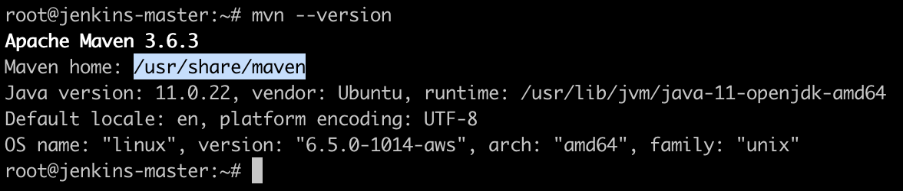
  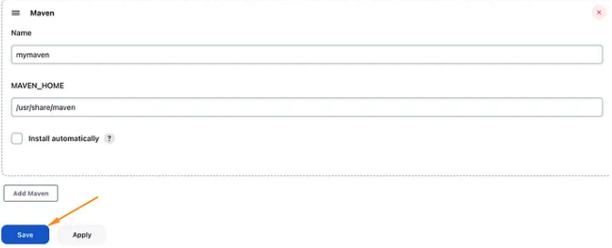

3. After the tools have been set up, the jobs are now ready to be started.

- Compile Job:
  The first job is the Compile Job, serving as the upstream job for the Test Job, which in turn becomes the upstream job for the Package Job. Additionally, the Compile Job is scheduled to trigger a build every hour.

  - On Jenkins Dashboard click New item > Job name > Select freestyle project and click OK.
    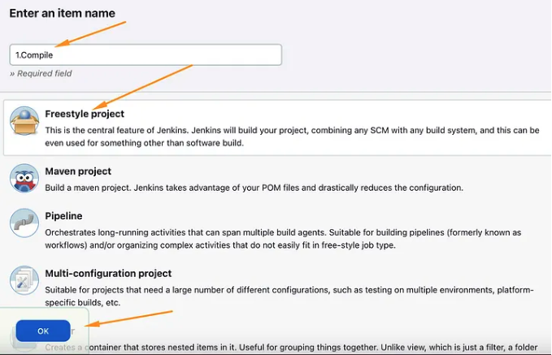

  - Go to source code management under git section to add the repository URL:
    [https://github.com/robinucar/CI-CD-PIPELINE_for_Retail_Company/](https://github.com/robinucar/CI-CD-PIPELINE_for_Retail_Company/)

    No credentials are required because it’s a public repo.

    **_ Branches to build should be main _**

    Then click Save

    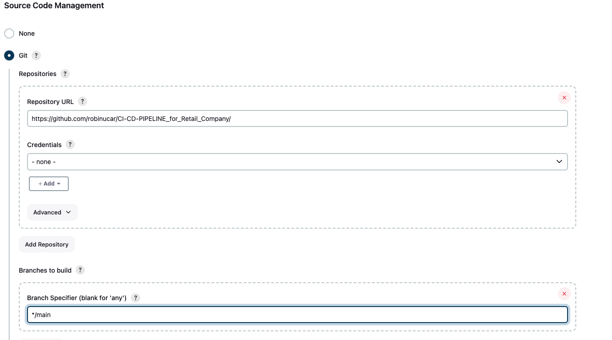

  - Next, navigate to the build steps and choose 'Invoke top-level Maven target.'

    - Under "Maven version," choose "mymaven," then set the command as "compile" under Goals, and finally, save the changes.
      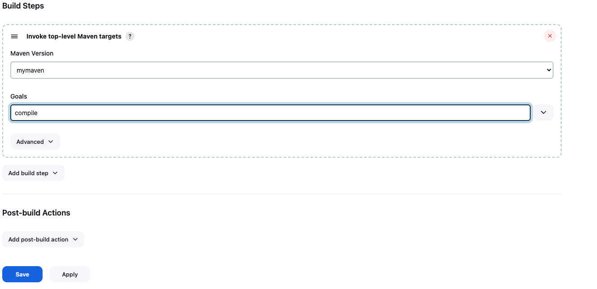

  - Now, we are prepared to compile our source code. Click 'Build Now' on the dashboard, and the successful compile job output will be displayed as shown below:
    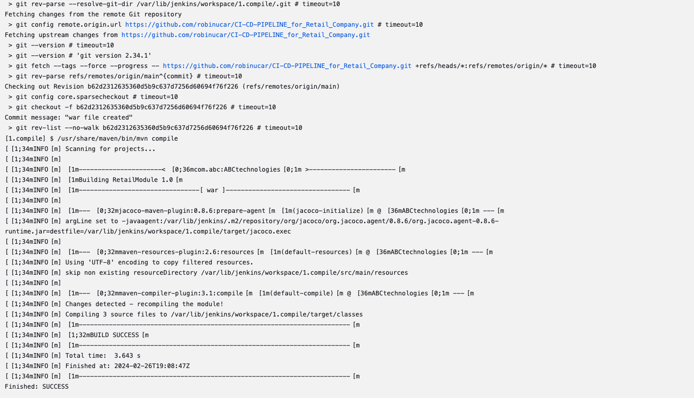

- Test Job:
  Next, we proceed to test the code using the same steps as above, with the only difference being that the goal in this case is 'test'.

  Navigate to build triggers to connect the test as a downstream job of the Compile job. This means that unit testing will be conducted immediately after the compile job is completed.

  To do this, go to 'Build Triggers' and select 'Build after other projects are built'. In the 'Projects to watch' field, type in the upstream job '1.Compile', then save and build the job.

  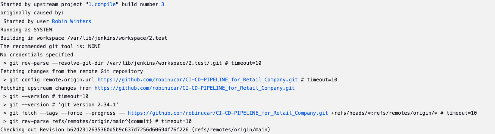
  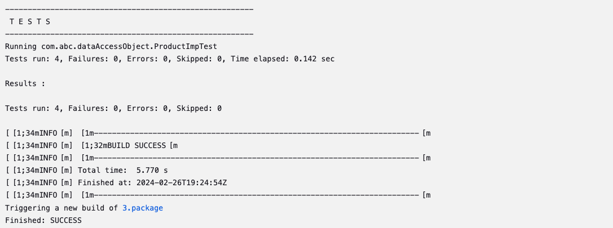

- Package Job:
  Now, the next step is to package the code into artifacts. Follow the same procedure as above, with the only difference being that the 'Goal' in this case is 'package'.

  Additionally, go to 'Build Triggers' and select 'Build after other projects are built'. In the 'Projects to watch' field, type in the upstream job as '2.Test', then save and build the job. The output is as shown below:

  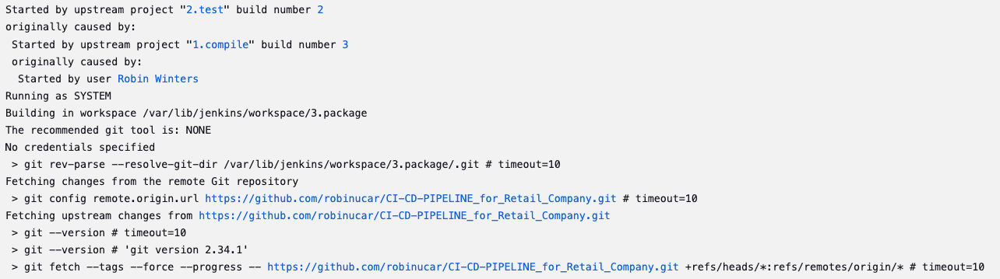
  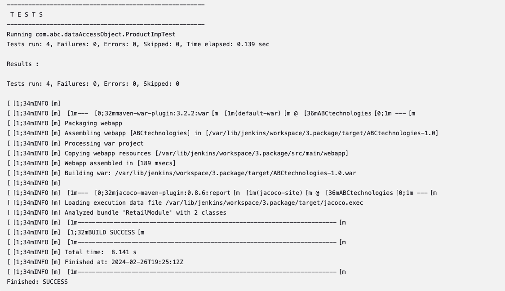

- Create a build pipeline:
  To visualize all the jobs as a pipeline, we need to download the Build Pipeline plugin.

1. Go to "Manage Jenkins" > "Manage Plugins".
2. Search for the "Build Pipeline" plugin and select it.
3. Install the plugin without restarting Jenkins.
4. After installing the plugin:

Return to the dashboard.

1. Click the plus (+) sign to configure the pipeline.
2. Give a name to the pipeline (e.g., "Retail-app-Pipeline").
   Select "Build Pipeline View".
   Click "OK".

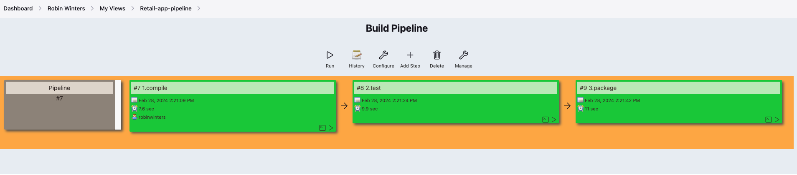

**_ END OF TASK 2 _**

## Task 3: Set up a master-slave node to distribute the tasks in the pipeline.

The primary server, known as the master machine, hosts Jenkins and manages various tasks such as configurations, build steps, SCM, and triggers. These tasks are created on the master machine and can be assigned to specific machines for execution. The console output of jobs executed on slave machines is visible on the master machine.

Both the master and slave machines should have Java versions 11 and 17 installed. If a slave machine is of the Amazon Linux type, it connects to the master via SSH.

Slave machines are virtual machines (VMs) running any operating system without Jenkins installed. Their primary function is to receive tasks from the master and execute them. All necessary tools required for the tasks must be installed on the slave machines. Additionally, an empty directory is created on each slave machine to serve as the workspace for the tasks.

To create a slave machine, navigate to AWS, create a new instance named "JenkinsSlave" with , Ubuntu use an existing key pair, set the security group rule to allow all traffic from anywhere, create the instance, and connect to the instance CLI.

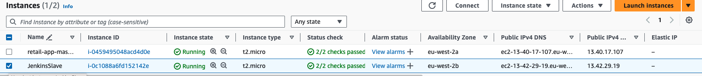

The following installations are required:

```
  # Update the package index and install Java OpenJDK 11
    sudo apt update
    sudo apt install openjdk-11-jdk -y

  # Install Git
    sudo apt install git -y

   # Install Maven
    sudo apt install maven -y
```

- Setting Up Slave
  Navigate to "Manage Jenkins" > "Manage Nodes and Clouds" > Click on the "+ New Node" button > Provide a name for the node: "Slave" > Select "Permanent Agent" > Click on the "Create" button.


- Configure the node settings as shown in the images below:
  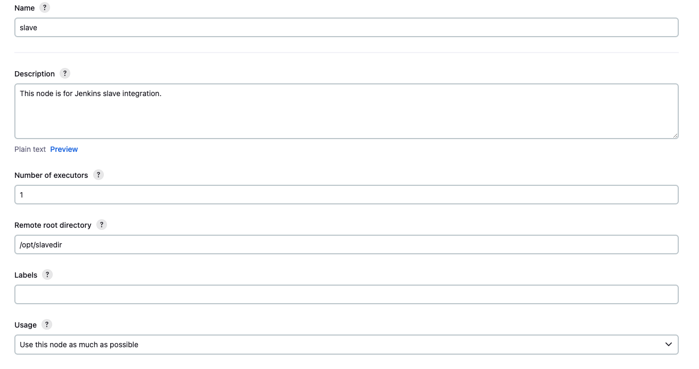
  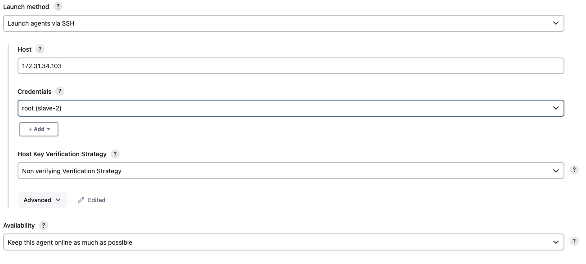
  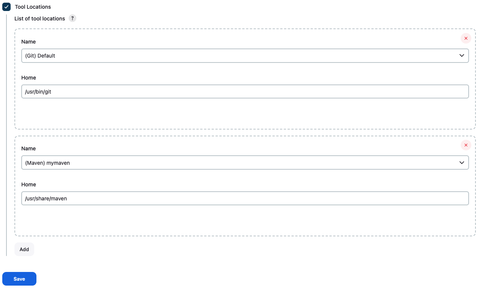
  Then click 'Save'.

- Finally Root Directory for Jenkins to Store temporary data on Slave.
  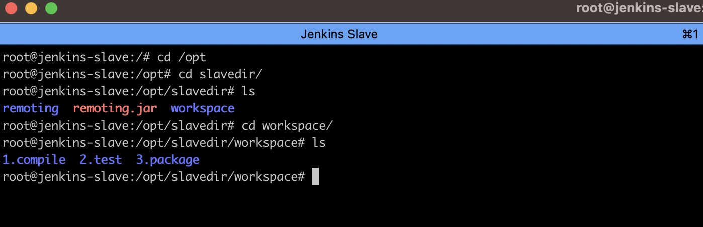

- Now we should be able to see all joba console outputs on the slave machine.
  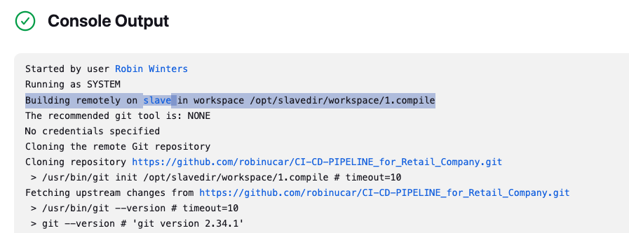
  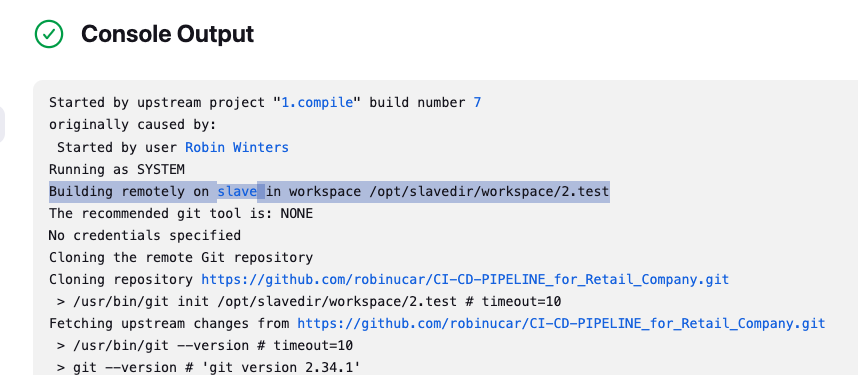
  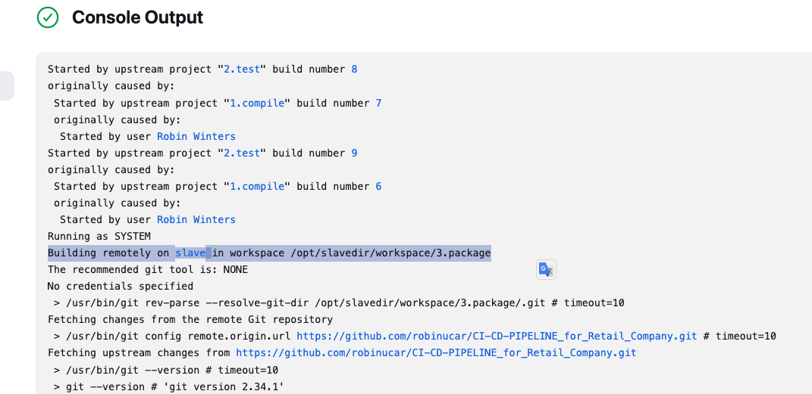

**_ END OF TASK 3 _**

## Task 4: Compose a Dockerfile. Generate an image and container on the Docker host. Establish integration between the Docker host and Jenkins. Construct a CI/CD job on Jenkins to facilitate building and deploying within a container.

1. Refine the package job established in step 1 of task 2 to generate a Docker image.
2. Incorporate code into the Docker image to transfer the WAR file to the Tomcat server and then proceed with building the image.

- The Dockerfile is being created using a Tomcat image sourced from the Docker Hub Repository.
  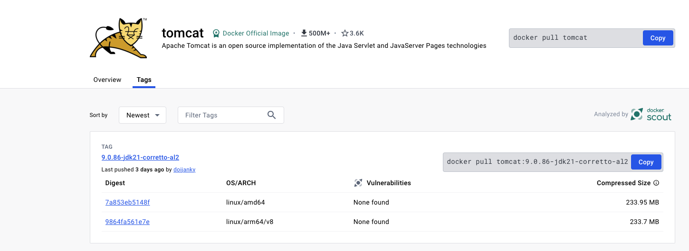

- The WAR file has already been obtained from the 3.package Job.
- I have copied the WAR file from the Package Job folder to my home folder and composed the Dockerfile as illustrated below:
  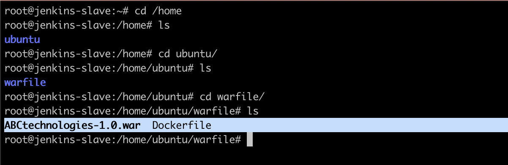

  ### Creating Dockerfile on Jenkins 3.package Job.

  - On Dockerfile Firstly, the latest Tomcat image is being used in the FROM command. Then, the WAR file is being added to the Tomcat $CATALINA_HOME folder, which is located at /usr/local/tomcat/webapps.

  - The steps below are executed subsequent to the Maven task of 3.packaging, thereby enhancing the Job.

    1. Execute a Shell Command Step in Jenkins:

    - Create a new directory at the home location (where the war file will be stored).

    2. Move the "ABCtechnologies-1.0.war" file to the "warfile" directory:

    - Move the "ABCtechnologies-1.0.war" file to the newly created "warfile" directory.

    3. Create a Dockerfile as shown in the screenshot below:

    - Follow the instructions provided in the screenshot to create a Dockerfile.

    4. Run the Docker build command to build the image:

    - Execute the Docker build command to build the Docker image based on the Dockerfile.

    5. Tag the image with my Docker repository:

    - After building the image, tag it with the appropriate name for Docker repository.

  - **_The Docker installation is required on the slave machine: The following commands must be executed on the slave machine._**

    ```
    # 1. Update the package index:
      sudo apt update
    # 2. Install necessary packages to allow apt to use a repository over HTTPS:
      sudo apt install apt-transport-https ca-certificates curl software-properties-common
    # 3. Add Docker's official GPG key:
      curl -fsSL https://download.docker.com/linux/ubuntu/gpg | sudo apt-key add -
    # 4. Add Docker repository to APT sources:
      sudo add-apt-repository "deb [arch=amd64] https://download.docker.com/linux/ubuntu $(lsb_release -cs) stable"
    # 5. Update the package index again:
      sudo apt update
    # 6. Install Docker:
      sudo apt install docker-ce
    # 7. Verify that Docker is installed correctly:
      sudo docker --version

    ```

    **Dockerfile**
    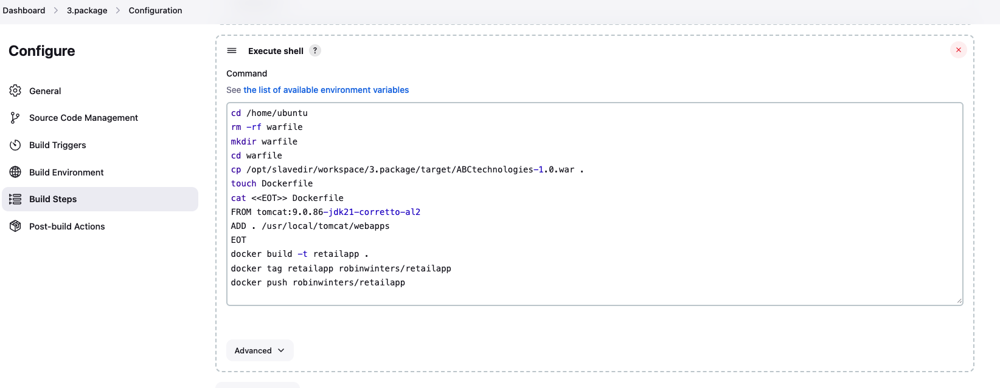

**CONSOLE OUTPUT**
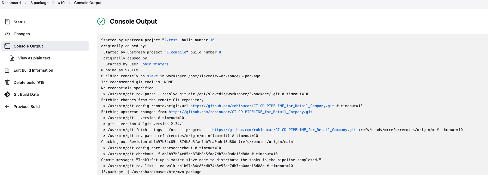
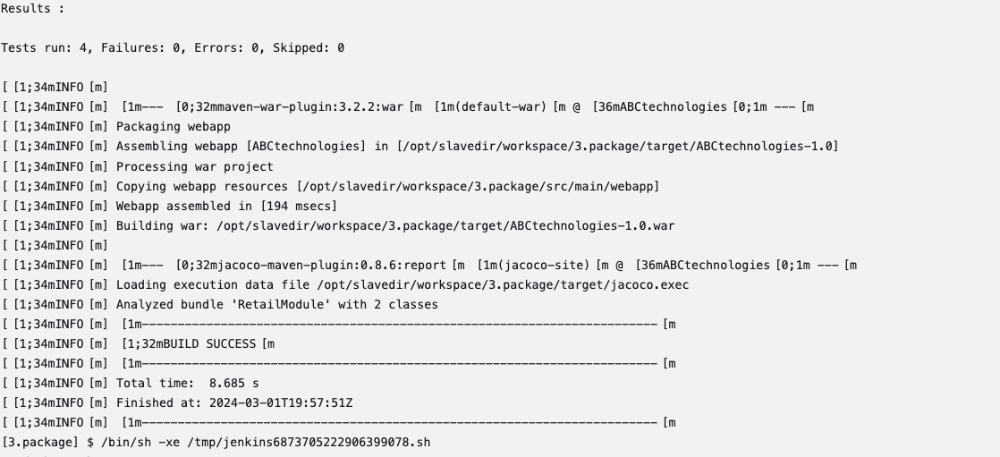
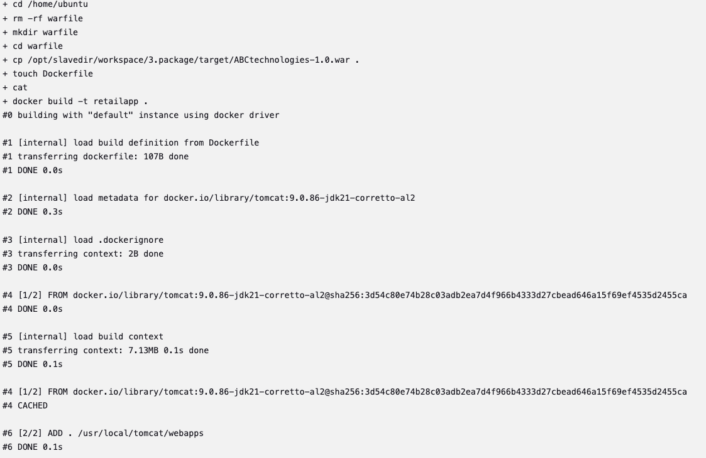
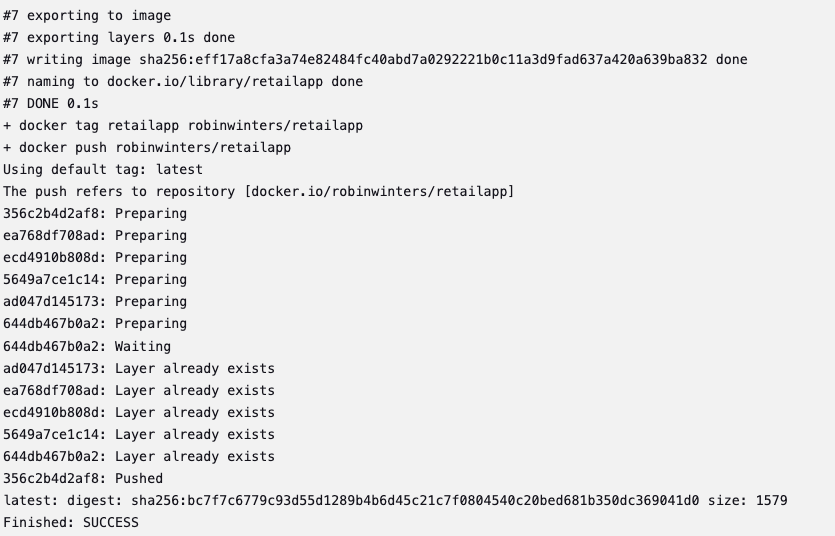

- After the image has been pushed, it is downloaded to the slave machine for testing whether the application can be accessed or not.
  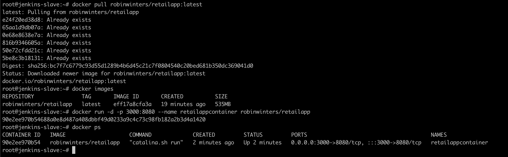
- The final step involves testing the container on the browser, ensuring to edit inbound rules to include the port address of the Docker container.
  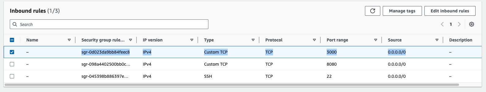
- "http://slave-machine-public-ip-address:3000/ABCtechnologies-1.0/"
  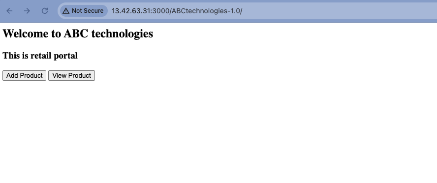
  **_ END OF TASK 4 _**
