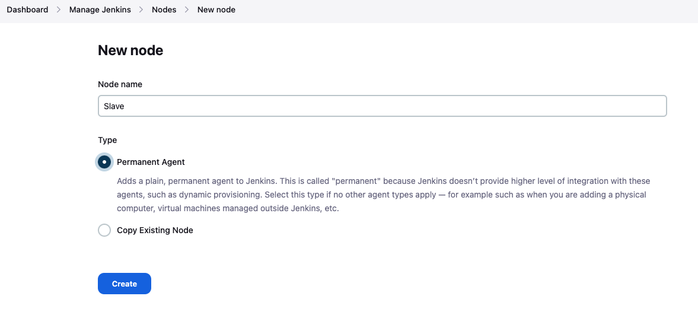
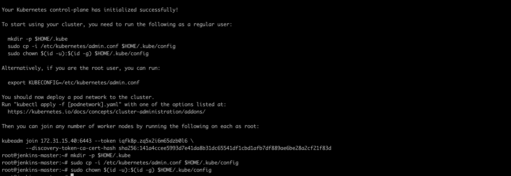
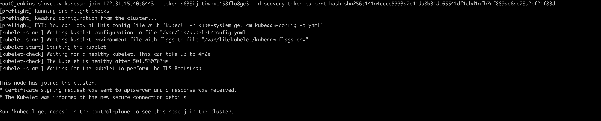
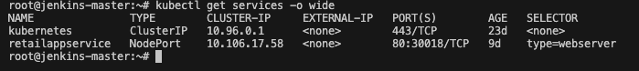
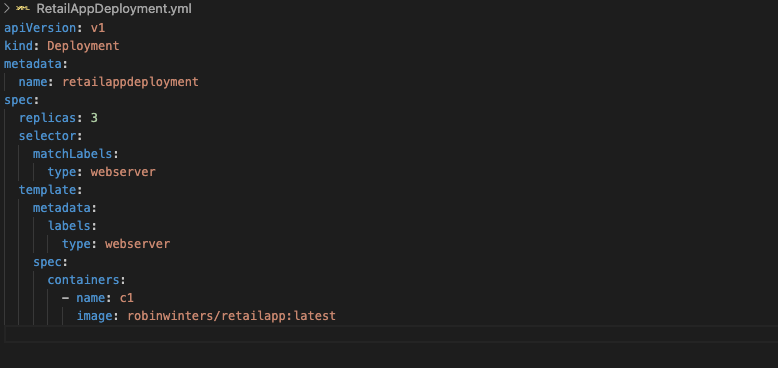

## Use Case

ABC Technologies is a prominent e-commerce platform that has recently obtained a sizable brick-and-mortar retail establishment. This retail entity boasts numerous physical stores worldwide but has adhered to traditional methods of growth and expansion. Consequently, it has incurred significant losses and is grappling with the subsequent hurdles.

- Low available.
- Low scalable.
- Low performance.
- Hard to build maintain.

Developing and deploying consume significant time and resources. ABC Technologies aims to leverage data from various storage systems to drive analytics and predict the company's growth and sales trajectory. Initially, ABC will focus on creating servlets for product addition and displaying product details. It's essential to include servlet dependencies necessary for compiling the servlets. Additionally, an HTML page will be developed for adding products.

The team employs Git for source code management. ABC has opted to adopt the DevOps model. Once the source code is hosted on GitHub, integration with Jenkins will enable continuous build generation for seamless continuous delivery. Furthermore, integration with Ansible and Kubernetes is vital for efficient deployment. Docker Hub will facilitate the transfer of images between Ansible and Kubernetes, ensuring smooth operations.

## Goal of the Project

To implement CI/CD such that ABC Company is able to be —

- high available
- high scalable
- high performant
- easily built and maintained
- developed and deployed quickly

## Problem Statements / Tasks

We need to develop a CI/CD pipeline to automate the software development, testing, packaging, and deployment, reducing the time to market the app and ensuring good quality service is experienced by end users. In this project, we need to —

- Push the code to our GitHub repository
- Create a continuous integration pipeline using Jenkins to compile, test, and package the code present in GitHub.
- Write Dockerfile to push the war file to the Tomcat server
- Integrate Docker with Ansible and write the playbook
- Deploy artifacts to the Kubernetes cluster
- Monitor resources using Grafana.

## Task 1: Clone the project from the GitHub link shared in resources to your local machine. Build the code using Maven commands.

### Setup Project

> **Important Note:** All commands below should be run from the root directory.

- To achieve this task first of all, download the provided Java Source Code into on my Local PC and then created a GitHub Repository and uploaded all the project files to the repo.
  

- Launch an EC2 Linux instance (type: t2.micro) named retail-app-master. set the security group rule to allow all traffic from anywhere and create the instance.
  

- Connect to retail-app-pro server using local terminal and installed git to retail-app-master instance.

  `sudo apt-get install git`

- Clone the repository using git clone command as shown below to clone the repo from my Github to my Amazon EC2 Linux machine.

  `git clone https://github.com/robinucar/CI-CD-PIPELINE_for_Retail_Company.git`

- Install java to my EC2 retail-app-master instance.

  ```
   #To update the machine
      sudo apt update
    #To install java
      sudo apt install openjdk-11-jdk -y
  ```

- Install Jenkins

  - To install jenkins go to the website [Jenkins](https://pkg.jenkins.io/debian-stable/) and then select “debian-stable/”for a stable version of jenkins. Follow the procedure to install jenkins.

    ```sudo wget -O /usr/share/keyrings/jenkins-keyring.asc \
      https://pkg.jenkins.io/debian-stable/jenkins.io-2023.key

      # Then add a Jenkins apt repository entry:

      echo deb [signed-by=/usr/share/keyrings/jenkins-keyring.asc] \
      https://pkg.jenkins.io/debian-stable binary/ | sudo tee \
      /etc/apt/sources.list.d/jenkins.list > /dev/null

      # Update your local package index, then finally install Jenkins:

        sudo apt-get update
        sudo apt-get install fontconfig openjdk-11-jre
        sudo apt-get install jenkins
    ```

  - Start jenkins using the command:

    ```
    sudo systemctl start jenkins
    sudo systemctl enable jenkins
    sudo systemctl status jenkins
    ```

- Install Maven which will be used to Compile, Test and Package the Code. Run the following commands to install maven

  ```
    sudo apt update
    sudo apt install maven
    mvn -version
  ```

  

**Now all the setup required is done. We need to start to building.**

### Building process

1. Navigate to the directory in which the source code and files are and then run the command below:

```
  cd CI-CD-PIPELINE_for_Retail_Company/
  mvn compile
```


2. Testing the code: To test the code go to directory which the source code and files are and then run the command below:

`mvn test`


3. Packaging the code: To package the code go to directory which the source code and files are and then run the command below:

`mvn package`


**_War File Created_**

The result output, the war file file created in the target folder is as shown below image.


**_ END OF TASK 1 _**

## Task 2: Login to Jenkins and start to create build pipeline containing the jobs.

1.  Log in to Jenkins

- Jenkins can be accessed over the browsers through the port number 8080. Take the public ip address from the EC2 Instance and paste the code below on the browser.

```
  public IP address:8080
  # in my case
    13.40.17.107:8080
```

**\_To resolve any connection issues, ensure that you add custom TCP port 8080 to the inbound rules of the security group.**


**Get the password, run the code below on your terminal.**

`cat /var/lib/jenkins/secrets/initialAdminPassword`

Then copy the password and paste to administrator password of Jenkins login page. Follow the promts until the dashboard access is fully set.

2. The next step is to set up the necessary tools with Jenkins: Maven, Java, and Git.
   To do this, go to the Jenkins dashboard > Manage Jenkins > Tools.

- Use the command below to find the JAVA_HOME.

```
  update-alternatives --config java
```


**The selected part of output is JAVA_HOME**

- Copy the JAVA_HOME address as shown in the image above, then paste it into the Jenkins JDK installations tool..
  

- For Git Integration we do need to make any changes, we work with the default settings.

- Maven has already been installed through the CLI. The MAVEN_HOME from the selected part of the output below should be copied, and then pasted into the 'MAVEN_HOME' input field in the Jenkins Maven tool. Then click 'Save'.
  
  

3. After the tools have been set up, the jobs are now ready to be started.

- Compile Job:
  The first job is the Compile Job, serving as the upstream job for the Test Job, which in turn becomes the upstream job for the Package Job. Additionally, the Compile Job is scheduled to trigger a build every hour.

  - On Jenkins Dashboard click New item > Job name > Select freestyle project and click OK.
    

  - Go to source code management under git section to add the repository URL:
    [https://github.com/robinucar/CI-CD-PIPELINE_for_Retail_Company/](https://github.com/robinucar/CI-CD-PIPELINE_for_Retail_Company/)

    No credentials are required because it’s a public repo.

    **_ Branches to build should be main _**

    Then click Save

    

  - Next, navigate to the build steps and choose 'Invoke top-level Maven target.'

    - Under "Maven version," choose "mymaven," then set the command as "compile" under Goals, and finally, save the changes.
      

  - Now, we are prepared to compile our source code. Click 'Build Now' on the dashboard, and the successful compile job output will be displayed as shown below:
    

- Test Job:
  Next, we proceed to test the code using the same steps as above, with the only difference being that the goal in this case is 'test'.

  Navigate to build triggers to connect the test as a downstream job of the Compile job. This means that unit testing will be conducted immediately after the compile job is completed.

  To do this, go to 'Build Triggers' and select 'Build after other projects are built'. In the 'Projects to watch' field, type in the upstream job '1.Compile', then save and build the job.

  
  

- Package Job:
  Now, the next step is to package the code into artifacts. Follow the same procedure as above, with the only difference being that the 'Goal' in this case is 'package'.

  Additionally, go to 'Build Triggers' and select 'Build after other projects are built'. In the 'Projects to watch' field, type in the upstream job as '2.Test', then save and build the job. The output is as shown below:

  
  

- Create a build pipeline:
  To visualize all the jobs as a pipeline, we need to download the Build Pipeline plugin.

1. Go to "Manage Jenkins" > "Manage Plugins".
2. Search for the "Build Pipeline" plugin and select it.
3. Install the plugin without restarting Jenkins.
4. After installing the plugin:

Return to the dashboard.

1. Click the plus (+) sign to configure the pipeline.
2. Give a name to the pipeline (e.g., "Retail-app-Pipeline").
   Select "Build Pipeline View".
   Click "OK".


**_ END OF TASK 2 _**

## Task 3: Set up a master-slave node to distribute the tasks in the pipeline.

The primary server, known as the master machine, hosts Jenkins and manages various tasks such as configurations, build steps, SCM, and triggers. These tasks are created on the master machine and can be assigned to specific machines for execution. The console output of jobs executed on slave machines is visible on the master machine.

Both the master and slave machines should have Java versions 11 and 17 installed. If a slave machine is of the Amazon Linux type, it connects to the master via SSH.

Slave machines are virtual machines (VMs) running any operating system without Jenkins installed. Their primary function is to receive tasks from the master and execute them. All necessary tools required for the tasks must be installed on the slave machines. Additionally, an empty directory is created on each slave machine to serve as the workspace for the tasks.

To create a slave machine, navigate to AWS, create a new instance named "JenkinsSlave" with , Ubuntu use an existing key pair, set the security group rule to allow all traffic from anywhere, create the instance, and connect to the instance CLI.


The following installations are required:

```
  # Update the package index and install Java OpenJDK 11
    sudo apt update
    sudo apt install openjdk-11-jdk -y

  # Install Git
    sudo apt install git -y

   # Install Maven
    sudo apt install maven -y
```

- Setting Up Slave
  Navigate to "Manage Jenkins" > "Manage Nodes and Clouds" > Click on the "+ New Node" button > Provide a name for the node: "Slave" > Select "Permanent Agent" > Click on the "Create" button.



- Configure the node settings as shown in the images below:
  
  
  
  Then click 'Save'.

- Finally Root Directory for Jenkins to Store temporary data on Slave.
  

- Now we should be able to see all joba console outputs on the slave machine.
  
  
  

**_ END OF TASK 3 _**

## Task 4: Compose a Dockerfile. Generate an image and container on the Docker host. Establish integration between the Docker host and Jenkins. Construct a CI/CD job on Jenkins to facilitate building and deploying within a container.

1. Refine the package job established in step 1 of task 2 to generate a Docker image.
2. Incorporate code into the Docker image to transfer the WAR file to the Tomcat server and then proceed with building the image.

- The Dockerfile is being created using a Tomcat image sourced from the Docker Hub Repository.
  

- The WAR file has already been obtained from the 3.package Job.
- I have copied the WAR file from the Package Job folder to my home folder and composed the Dockerfile as illustrated below:
  

  ### Creating Dockerfile on Jenkins 3.package Job.

  - On Dockerfile Firstly, the latest Tomcat image is being used in the FROM command. Then, the WAR file is being added to the Tomcat $CATALINA_HOME folder, which is located at /usr/local/tomcat/webapps.

  - The steps below are executed subsequent to the Maven task of 3.packaging, thereby enhancing the Job.

    1. Execute a Shell Command Step in Jenkins:

    - Create a new directory at the home location (where the war file will be stored).

    2. Move the "ABCtechnologies-1.0.war" file to the "warfile" directory:

    - Move the "ABCtechnologies-1.0.war" file to the newly created "warfile" directory.

    3. Create a Dockerfile as shown in the screenshot below:

    - Follow the instructions provided in the screenshot to create a Dockerfile.

    4. Run the Docker build command to build the image:

    - Execute the Docker build command to build the Docker image based on the Dockerfile.

    5. Tag the image with my Docker repository:

    - After building the image, tag it with the appropriate name for Docker repository.

  - **_The Docker installation is required on the slave machine: The following commands must be executed on the slave machine._**

    ```
    # 1. Update the package index:
      sudo apt update
    # 2. Install necessary packages to allow apt to use a repository over HTTPS:
      sudo apt install apt-transport-https ca-certificates curl software-properties-common
    # 3. Add Docker's official GPG key:
      curl -fsSL https://download.docker.com/linux/ubuntu/gpg | sudo apt-key add -
    # 4. Add Docker repository to APT sources:
      sudo add-apt-repository "deb [arch=amd64] https://download.docker.com/linux/ubuntu $(lsb_release -cs) stable"
    # 5. Update the package index again:
      sudo apt update
    # 6. Install Docker:
      sudo apt install docker-ce
    # 7. Verify that Docker is installed correctly:
      sudo docker --version

    ```

    **Dockerfile**
    

**CONSOLE OUTPUT**


- After the image has been pushed, it is downloaded to the slave machine for testing whether the application can be accessed or not.
  
- The final step involves testing the container on the browser, ensuring to edit inbound rules to include the port address of the Docker container.
  
- "http://slave-machine-public-ip-address:3000/ABCtechnologies-1.0/"
  
  **_ END OF TASK 4 _**

## Task 5: Integrate Docker and Kubernetes

1. Install Kubernetes to both Master and Slave machine.
   
2. Print join command on master machine using kubeadm

```
  sudo kubeadm token create --print-join-command
```


3. Connect slave machine to master machine using kubeadm join command.
   

- Following the installation of Kubernetes and establishing connections between the Master and Node instances, I proceeded to generate manifest files for the Service and Deployment to verify the functionality of the setup.

#### Manifests Files

1. Service Manifests File:
   Service Manifests File should cover below information

- apiVersion: Specifies the version of the Kubernetes API we're using.
- kind: Defines the type of Kubernetes resource.
- metadata: Contains metadata about the Service.
- spec: Specifies the desired state for the Service.
- type: Defines the type of Service.
- selector: Specifies the Pods that Service should target.
- ports: Specifies the ports that the Service should listen on.
- port: The port on which the Service will listen within the cluster.
- targetPort: The port on the Pods to which traffic will be forwarded.
- nodePort: The port on each Node on which the Service will be accessible.

Below is the Service Manifest File for RetailAppService.yml, covering the specified information:


After we defined and created RetailAppService.yml,

```
kubectl create -f RetailAppService.yml
```

when we run kubectl get services -o wide command we should see below output.

- NAME: The name of the service.
- TYPE: The type of service. In this case, ClusterIP and NodePort.
- CLUSTER-IP: The cluster internal IP address assigned to the service.
- EXTERNAL-IP: The external IP address, which is <none> for ClusterIP and NodePort services.
- PORT(S): The ports exposed by the service, including the mapping from the service port to the target port.
- AGE: The amount of time since the service was created.
- SELECTOR: The labels used to select the pods targeted by the service.



\*\* kubernetes: This is a system service created automatically by Kubernetes.

2. Deployment Manifests File:
   Deployment Manifests File should cover below information
   

- apiVersion: Specifies the version of the Kubernetes API we're using.
- kind: Defines the type of Kubernetes resource.
- metadata: Contains metadata about the Deployment.
- name: The name of the Deployment.
- spec: Specifies the desired state for the Deployment.
- replicas: Specifies the number of Pod replicas that should be running at any given time.
- selector: Defines how to identify the Pods that belong to this Deployment.
- matchLabels: Specifies the labels that Pods must have to be managed by this Deployment.
- type: The label used to match Pods.
- template: Describes the Pods that will be created by the Deployment.
- metadata: Contains metadata about the Pods, including their labels.
- labels: The labels assigned to the Pods.
- type: The label assigned to the Pods created by this Deployment.
- spec: Specifies the desired state for the Pods.
- containers: Specifies the containers that will run in the Pods.
- name: The name of the container.
- image: The container image to use.

After we defined and created RetailAppDeployment.yml,

```
kubectl create -f RetailAppDeployment.yml
```

when we run kubectl get services -o wide command we should see below output.

- NAME: The deployment is named retailappdeployment.
- READY: All 3 out of 3 replicas are ready.
- UP-TO-DATE: All 3 replicas are up-to-date.
- AVAILABLE: All 3 replicas are available.
- AGE: The deployment has been running for 7 days and 2 hours.

```
 
```

- PODS running on the kubernetes cluster.
  

- Also when we run

```
kubectl get all -o wide
```

command, it provides comprehensive information about all Kubernetes resources in our current namespace, including pods, services, deployments, and replicasets.


At this point, Pods, Deployment, and Service have been successfully created via Kubernetes.

When we check on the browser with our slave machine ip + port we should see our app is successfully running.


## Task 6: Using Prometheus, monitor resources such as CPU utilization (total usage, usage per core, and usage breakdown), memory, and network on the instance by providing endpoints on the local host. Install the Node Exporter and add its URL to the Prometheus targets. Use this data to log in to Grafana and create a dashboard displaying these metrics.

#### Step 1: Install Prometheus and Grafana to master machine and Node Exporter top both master and slave machine and configure them.

- Visit the Prometheus download page to get the latest version.

  - I installed prometheus-2.45.5.darwin-amd64.tar.gz version
  - Configure prometheus.service
    

- Install grafana on master machine and connect Grafana with Prometheus

- Install Node exporter on the master and slave machines and configure node_exporter.service.
  

- Configure prometheus.yml to connect master and slave machine using node exporter.
  

#### Step 2: Open Prometheus and Grafana from the browser.

- Prometheus

  - master_public_ip:9090/targets

- Grafana
- master_public_ip:3000/

**_ Ensure that you modify the inbound rules on EC2 instances to permit traffic from ports 9090 and 3000 _**


#### Step 3: Once Grafana is accessed web interface Configure Prometheus as a Data Source. Navigate to Configuration > Data Sources and add Prometheus as a data source by providing the URL where your Prometheus instance is hosted.

#### Step 4: Create a Dashboard: After adding Prometheus as a data source, navigate to the "+" icon on the left panel and select "Dashboard." Choose "Add new panel" and then select a visualization type, such as "Graph" or any other preferred visualization.

#### Step 5: Query Prometheus Metrics: In the visualization panel, click on "Panel Title" and select "Edit." Here, you can input Prometheus queries to retrieve the metrics you wish to visualize. For instance, to fetch CPU usage, network usage etc...

- FOR CPU USAGE

  - Master CPU usage:
    
  - Slave CPU usage:
    

- FOR MEMORY USAGE

  - Master Memory Usage:
    

- FOR NETWORK USAGE

  - Master network usage:
    
    

  - Slave network usage:
    
    

## CONCLUSION

The first phase of the project, aimed at acquiring data from the offline business store for analytics and prediction, has been successfully completed by Retail App. Utilizing the DevOps model, the team automated the development, deployment, and testing of servlets and HTML pages. This has led to the establishment of a more reliable, scalable, and efficient system that is easier to maintain. Retail App stands to benefit from several advantages, including:

- Increased reliability: The automated build and deployment process ensure that the system remains up-to-date and error-free.

- Improved scalability: The system can effortlessly scale up or down to accommodate fluctuating demand.
- Enhanced performance: The automated testing process guarantees optimal system performance.
- Reduced costs: Automated procedures save time and money by eliminating the need for manual intervention.
- The team can be confident that the DevOps model will serve as a valuable asset for the company's continued growth and expansion.
